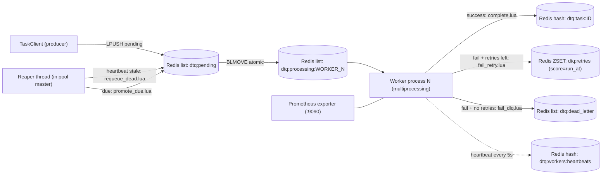
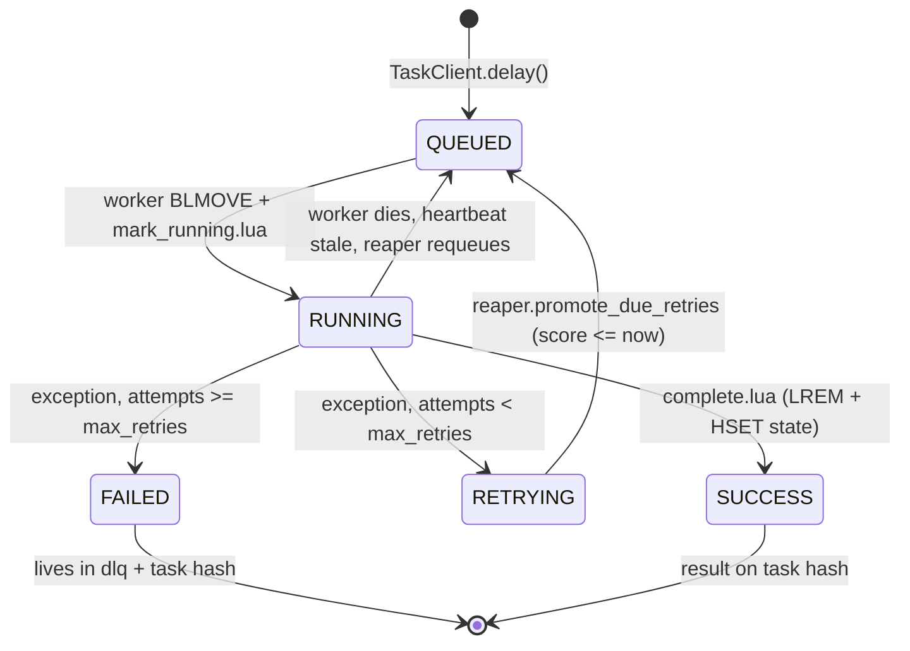

# dtq — a distributed task queue in pure Python

`dtq` is a from-scratch, multiprocessing-based distributed task queue. It uses
Redis as a dumb message broker and `multiprocessing` to bypass the Python GIL,
giving you true parallel execution of CPU-bound tasks across cores. State
transitions are atomic (Lua), failures are exponential-backoff retried,
poison-pill tasks land in a dead-letter queue, and workers that die mid-task
are recovered by a heartbeat-driven reaper.

No Celery, no RQ, no Dramatiq. The orchestration engine is built directly on
the Python standard library. Redis is only used for `LPUSH`/`BLMOVE`/`HSET`/
`ZADD` and a handful of Lua scripts.

---

## Why this exists

Most "build a task queue" tutorials stop at "function name into a list, worker
pops it off". That is not a task queue — it is a wishlist with no recovery
story. This project implements the parts that actually make a queue safe to
run in production:

- **GIL bypass via real OS processes.** A multiprocessing worker pool sized to
  `os.cpu_count()`, demonstrably scaling on a CPU-bound benchmark.
- **Atomic state transitions.** Every state change runs in a Lua script so the
  pair `LREM processing + HSET task hash` cannot be torn by a crash between
  the two calls.
- **Reliable-queue pattern with per-worker processing lists.** `BLMOVE`
  atomically pops a task from `pending` into `processing:<worker_id>`, so a
  worker that dies before acknowledging never loses the task — it sits in
  *its own* processing list until the reaper drains it.
- **Heartbeat-driven zombie recovery.** Workers heartbeat every 5 s. The
  reaper, running as a thread inside the pool master, requeues the
  processing-list of any worker whose heartbeat is older than the configured
  timeout (default 60 s).
- **Exponential backoff with full jitter, scheduled in Redis.** Failed tasks
  are inserted into a sorted set with a `score = run_at_epoch`. Workers are
  free during the wait — no `time.sleep` parked on a worker thread. The
  reaper promotes due retries back to pending.
- **Dead-letter queue.** After `max_retries` failures, a task moves to
  `dtq:dead_letter` with the full traceback preserved on the task hash for
  postmortem.
- **Operability.** Structured JSON logs, Prometheus metrics on `:9090`, a
  `dtq` CLI for ops (worker, enqueue, stats, replay-dlq, purge), graceful
  SIGTERM shutdown.
- **Testability.** Eighteen pytest tests against `fakeredis[lua]` exercise
  the Lua scripts, retry math, reaper recovery, and the worker loop end to
  end with zero external dependencies.

---

## Architecture



### Lifecycle of a single task



### Redis key layout

| Key | Type | Purpose |
| --- | --- | --- |
| `dtq:pending` | list | Task ids awaiting a worker (RPOP / BLMOVE source) |
| `dtq:processing:<worker_id>` | list | Tasks claimed by a specific worker (BLMOVE dest) |
| `dtq:retries` | zset | Task ids waiting for delayed retry (score = run_at epoch) |
| `dtq:dead_letter` | list | Permanently failed tasks |
| `dtq:workers:heartbeats` | hash | `worker_id -> last_heartbeat_epoch` |
| `dtq:task:<id>` | hash | Per-task metadata, args, result, traceback |

---

## Quick start (Windows + Docker Desktop)

### 1. Install Docker Desktop

1. Download Docker Desktop for Windows from <https://www.docker.com/products/docker-desktop/>.
2. Run the installer. When prompted, **enable the WSL 2 backend** (this is
   the default on modern Windows; do not switch to Hyper-V).
3. Reboot if the installer asks.
4. Launch Docker Desktop. Wait until the whale icon in the tray says "Docker
   Desktop is running".
5. Open PowerShell and confirm:
   ```powershell
   docker --version
   docker compose version
   ```

### 2. Boot Redis

From the project root:

```powershell
docker compose up -d
docker compose ps         # should show dtq-redis as "healthy" after a few seconds
docker compose logs redis # optional: tail the redis log
```

This starts a single `redis:7-alpine` container on `localhost:6379` with
append-only persistence and a named volume. To stop it: `docker compose down`
(keeps data) or `docker compose down -v` (also wipes the volume).

### 3. Install dtq

```powershell
python -m venv .venv
.\.venv\Scripts\Activate.ps1
pip install -e ".[dev]"
```

`dtq` requires Python 3.10 or newer. The only runtime deps are `redis` and
`prometheus-client`; the dev extra adds `pytest` and `fakeredis[lua]`.

### 4. Run the demo

In **Terminal 1**, start a worker pool:

```powershell
dtq worker
```

You should see one log line per spawned child process and a "reaper started"
line. The pool defaults to `os.cpu_count()` workers.

In **Terminal 2**, run the demo driver:

```powershell
python -m dtq.main
```

Watch Terminal 1: you will see four `calculate_primes` jobs running on four
different child PIDs simultaneously, the flaky API calls firing the retry
path with logged backoff delays, and one or two of them ending up in the DLQ
after exhausting retries.

When you are done, `Ctrl+C` the worker. It will perform a graceful shutdown:
the stop event flips, in-flight tasks finish, children join, the reaper
exits.

---

## CLI

```text
dtq worker                              # run pool (defaults to cpu_count() processes)
dtq worker --processes 4                # cap the pool size
dtq enqueue dtq.tasks.calculate_primes 200000
dtq enqueue dtq.tasks.fetch_flaky_api 42 --kw fail_rate=0.0 --wait
dtq stats                               # JSON dump of queue depths and live workers
dtq replay-dlq --all                    # move every DLQ task back to pending
dtq replay-dlq --task-id <id>           # replay one
dtq purge dtq:pending --yes             # nuclear option
```

`enqueue` JSON-decodes positional args and `--kw` values when possible, so
`200000` becomes an `int` and `--kw fail_rate=0.5` becomes a `float`.

---

## Configuration

Every knob is read from environment variables. Defaults are sensible for a
local Redis on 6379.

| Env var | Default | Purpose |
| --- | --- | --- |
| `DTQ_REDIS_URL` | `redis://localhost:6379/0` | Redis connection string |
| `DTQ_WORKER_PROCESSES` | `os.cpu_count()` | Worker pool size |
| `DTQ_MAX_RETRIES` | `3` | Default attempts before DLQ |
| `DTQ_BACKOFF_BASE_S` | `2.0` | Backoff multiplier base |
| `DTQ_BACKOFF_CAP_S` | `60.0` | Maximum backoff window |
| `DTQ_HEARTBEAT_INTERVAL_S` | `5.0` | Worker heartbeat cadence |
| `DTQ_WORKER_TIMEOUT_S` | `60.0` | Reaper "dead worker" threshold |
| `DTQ_REAPER_INTERVAL_S` | `5.0` | Reaper sweep interval |
| `DTQ_CLAIM_BLOCK_S` | `5.0` | BLMOVE block timeout (also wakeup interval for graceful shutdown) |
| `DTQ_SHUTDOWN_GRACE_S` | `15.0` | How long the master waits before SIGKILL |
| `DTQ_METRICS_ENABLED` | `1` | Set `0` to disable the Prometheus exporter |
| `DTQ_METRICS_PORT` | `9090` | Prometheus exporter port |
| `DTQ_LOG_LEVEL` | `INFO` | Log level for all components |
| `DTQ_LOG_JSON` | `1` | Set `0` for human-readable logs |

Queue and key names are also overridable (`DTQ_PENDING_QUEUE`, `DTQ_DLQ`,
`DTQ_RETRY_ZSET`, `DTQ_HEARTBEAT_HASH`, `DTQ_TASK_HASH_PREFIX`,
`DTQ_PROCESSING_PREFIX`).

---

## Observability

### Logs

Default output is one JSON object per line. Pipe through `jq` for ad-hoc
queries; ship to Loki / Datadog / Cloudwatch with no further parsing.
Example:

```json
{"ts":"2026-04-18T19:32:01.412Z","level":"INFO","logger":"dtq.worker.host-12345-0-a1b2c3","msg":"task succeeded","pid":12347,"thread":"MainThread","component":"dtq.worker.host-12345-0-a1b2c3","host_pid":12347,"task_id":"5fa7…","func":"dtq.tasks.calculate_primes","duration_s":3.214}
```

For local development set `DTQ_LOG_JSON=0` for the human formatter.

### Metrics

The pool master starts a Prometheus exporter on `:9090/metrics` (configurable).
Available series:

- `dtq_tasks_enqueued_total{task}`
- `dtq_tasks_completed_total{task,status}`  (`status` ∈ `success` / `failed`)
- `dtq_tasks_retried_total{task}`
- `dtq_tasks_dlq_total{task}`
- `dtq_task_duration_seconds{task}`  (histogram)
- `dtq_queue_depth{queue}`           (`pending` / `dlq` / `retries` / `processing:*`)
- `dtq_workers_alive`
- `dtq_reaper_recovered_total`
- `dtq_reaper_promoted_total`

Wire up Prometheus + Grafana with their stock `redis-exporter` dashboard for
broker-side stats, plus a custom panel on the series above for app-side stats.

---

## Benchmark

The headline experiment lives in `benchmarks/gil_bypass.py`. It enqueues
N copies of `calculate_primes(n)` (a pure-Python, GIL-bound prime sieve),
runs the pool with one process, runs it again with `os.cpu_count()`
processes, and prints the wall-clock speedup.

```powershell
docker compose up -d
.\.venv\Scripts\Activate.ps1
python -m benchmarks.gil_bypass --jobs 8 --n 200000
```

Example output (8-core laptop):

```
GIL-bypass benchmark: 8 x calculate_primes(200000)
Redis: redis://localhost:6379/0
CPU count: 8

 processes      wall      mean   speedup  status
-------------------------------------------------------
         1    47.18s    47.18s     1.00x  ok
         8     7.62s     7.62s     6.19x  ok
```

The numbers will vary by CPU, but the property is stable: ~6-8× speedup on
an 8-core box. Threads cannot deliver this on pure-Python CPU work, which
is the entire point of the multiprocessing design.

---

## Tests

```powershell
.\.venv\Scripts\Activate.ps1
pytest -v
```

The suite uses `fakeredis[lua]` (no Docker required) and runs in well under
a second:

```
tests/test_client.py ....           [ 22%]
tests/test_lua_atomicity.py ....    [ 44%]
tests/test_reaper.py ...            [ 61%]
tests/test_retries.py ....          [ 83%]
tests/test_worker_loop.py ...       [100%]
========== 18 passed ==========
```

Notable tests:

- `test_lua_atomicity.py::test_two_workers_cannot_claim_the_same_task` —
  spins up two threads racing on a single-task queue and asserts exactly one
  wins, with the task ending in `RUNNING` state owned by the winner.
- `test_reaper.py::test_dead_worker_processing_list_is_drained_back_to_pending`
  — backdates a worker heartbeat, runs a reaper tick, asserts the in-flight
  task is back on `pending` with `attempts` bumped.
- `test_worker_loop.py::test_worker_loop_retries_then_succeeds` —
  monkey-patches a task to fail twice then succeed, drives the worker loop
  + reaper through three claim cycles, asserts final state is `SUCCESS` with
  `attempts == 2`.

---

## Failure-mode walkthrough

| Failure | What happens | How dtq notices | Recovery |
| --- | --- | --- | --- |
| Task raises a Python exception | Worker catches it, computes backoff, calls `fail_retry.lua` | Worker, immediately | Reaper promotes from `dtq:retries` when `score <= now` |
| Same task fails `max_retries+1` times | Worker calls `fail_dlq.lua` instead | Worker, immediately | Manual `dtq replay-dlq --task-id <id>` after fix |
| Worker process is `kill -9`'d mid-task | Heartbeat stops; task sits in `dtq:processing:<id>` | Reaper, after `worker_timeout_s` | `requeue_dead.lua` drains the list back to `pending`, bumps `attempts`, deletes heartbeat |
| Worker hangs (livelock, infinite loop) | Heartbeat may stay fresh if heartbeat thread is independent — currently it is in the main loop, so a hang in the task body will eventually look like a dead worker | Reaper, after `worker_timeout_s` | Same as above |
| Producer crashes after pushing | Task is durably on `dtq:pending` already | n/a | Worker picks it up normally |
| Redis restarts | AOF (`--appendonly yes` in `docker-compose.yml`) replays on boot; in-flight `processing:*` lists survive | Reaper sweeps stale workers post-restart | All in-flight tasks get redelivered |
| Pool master crashes (children orphaned) | Children continue claiming tasks but no reaper | Operator | Restart pool; new master's reaper sweeps stale heartbeats from old workers |
| Unknown task path (deploy skew) | Worker catches `UnknownTaskError`, sends straight to DLQ (no retries — would be wasteful) | Worker, immediately | Deploy the missing module, then `dtq replay-dlq` |

---

## Project layout

```
distributed-task-queue/
  docker-compose.yml          # redis:7-alpine
  pyproject.toml              # deps + `dtq` console_scripts entry
  README.md
  src/dtq/
    config.py                 # env-driven Settings
    logging_setup.py          # JSON / human formatters
    serializer.py             # pickle wrapper with size guard
    registry.py               # dotted path -> callable
    task.py                   # Task dataclass + TaskState + TaskField
    broker.py                 # Redis facade + Lua loader
    lua/
      mark_running.lua
      complete.lua
      fail_retry.lua
      fail_dlq.lua
      requeue_dead.lua
      promote_due.lua
    client.py                 # TaskClient.delay / get_state / get_result / wait
    worker.py                 # WorkerPool + worker_loop
    reaper.py                 # heartbeat scanner + due-retry promoter
    retries.py                # exponential backoff with full jitter
    metrics.py                # Prometheus counters / histograms / gauges
    tasks.py                  # process_sales_csv / calculate_primes / fetch_flaky_api
    cli.py                    # dtq CLI
    main.py                   # demo driver from the spec
  benchmarks/
    gil_bypass.py             # 1-proc vs N-proc speedup
  tests/
    conftest.py               # fakeredis fixtures
    test_client.py
    test_lua_atomicity.py
    test_reaper.py
    test_retries.py
    test_worker_loop.py
```

---

## Design notes for reviewers

- **Why dotted paths instead of pickling functions.** Pickling raw functions
  binds the queue to one specific Python version and one specific git SHA on
  the worker. That is the canonical Celery footgun. dtq sends
  `(dotted_path, args, kwargs)` over the wire and resolves the path on the
  worker via `importlib`, which is what every production task queue actually
  does. Args and kwargs still go through pickle.
- **Why a per-worker processing list, not a shared one.** With one shared
  `dtq:processing` list, recovery requires per-task timestamps and a scan
  for stale entries — race-prone and quadratic. With a per-worker list,
  recovery is just "this worker is dead, drain its list" — O(N) in the
  number of tasks the worker actually held, atomic in a single Lua call.
- **Why heartbeats over `claimed_at`.** A `claimed_at` timestamp tells you
  when a worker took a task, but not whether the worker is still alive — a
  long task is indistinguishable from a dead worker. A heartbeat is a
  liveness signal that decouples task duration from worker liveness, which
  is the property we actually need.
- **Why scheduled retries in a ZSET, not a sleeping worker.** Sleeping in a
  worker is operationally awful — it caps your throughput at
  `n_workers / max_retry_delay`, and a worker holding a sleeping task can't
  do anything else. A ZSET-scheduled retry frees the worker immediately and
  delegates the wait to a single reaper that does cheap range queries.
- **Why metrics per-process, not multiprocess collector.** The
  `prometheus_client` multiprocess mode introduces shared mmap files and a
  configuration dance that obscures the moving parts of the demo. The
  per-process registries here are honest about what they measure (one
  process at a time) and the master separately scrapes Redis for the
  aggregate gauges (`dtq_queue_depth`, `dtq_workers_alive`).

---

## License

MIT.
