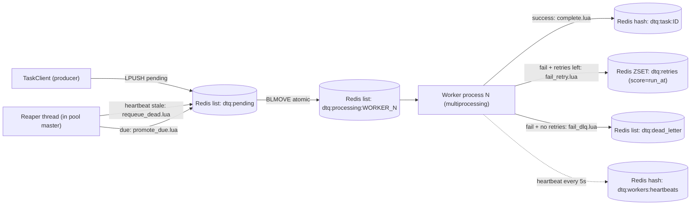
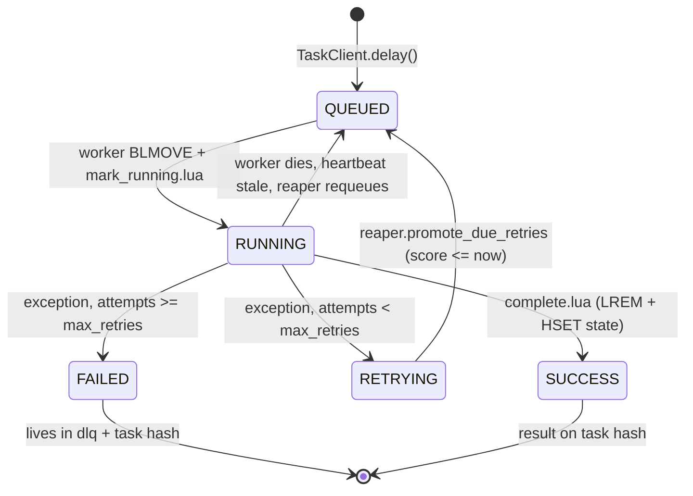

# dtq — a distributed task queue in pure Python

`dtq` is a from-scratch, multiprocessing-based distributed task queue. It uses
Redis as a dumb message broker, implements every state transition as an atomic
Lua script, guarantees no task is lost across worker crashes via the reliable-queue
pattern, recovers in-flight work from dead workers with a heartbeat-driven reaper,
and demonstrably bypasses the Python GIL — measured at **6.78× wall-clock speedup**
on a pure-Python CPU-bound benchmark (16 workers vs 1, 16-logical-CPU host).

No Celery, no RQ, no Dramatiq. The orchestration engine is built directly on
the Python standard library. Redis is only used for `LPUSH`/`BLMOVE`/`HSET`/
`ZADD` and six small Lua scripts.

---

## The four things this project is about

1. **Atomic state machine via Lua scripts.** Every state transition
   (`QUEUED -> RUNNING -> SUCCESS | RETRYING | FAILED`) runs as a single
   Redis `EVAL`. There is no window where a worker crash can leave the task
   in a torn state (e.g. removed from the processing list but never marked
   done). [See `src/dtq/lua/`.](src/dtq/lua/)

2. **Reliable queue with `BLMOVE` + per-worker processing lists.** The
   blocking pop-and-stage primitive atomically moves a task id from
   `dtq:pending` to `dtq:processing:<worker_id>`. A worker that dies between
   claiming and completing never loses the task — it sits in *that worker's*
   processing list until the reaper drains it. Per-worker lists make
   recovery O(N in dead-worker's list) instead of O(N in the whole queue).

3. **Heartbeat-driven reaper (one thread, two jobs).** A single background
   thread in the pool master (1) promotes delayed retries from a Redis ZSET
   back to `pending` when their `run_at` time elapses, and (2) detects dead
   workers (heartbeat older than `worker_timeout_s`) and atomically requeues
   their entire processing list. Both jobs are "time-based recovery" and
   share one loop. [See `src/dtq/reaper.py`.](src/dtq/reaper.py)

4. **Real GIL bypass, measured.** Workers are `multiprocessing.Process`
   children, each with its own Python interpreter and its own Redis
   connection. On a pure-Python CPU-bound workload the benchmark shows
   **6.78× speedup** going from 1 worker to 16 on a 16-logical-CPU host
   (1 worker: 27.12 s, 16 workers: 4.00 s for the same 16 tasks).

Plus two operational niceties: a dead-letter queue for poison-pill tasks,
and a `dtq replay-dlq` CLI command to re-enqueue them after you fix the bug.

---

## Architecture



### Lifecycle of a single task



### Redis key layout

| Key | Type | Purpose |
| --- | --- | --- |
| `dtq:pending` | list | Task ids awaiting a worker (BLMOVE source) |
| `dtq:processing:<worker_id>` | list | Tasks claimed by a specific worker (BLMOVE dest) |
| `dtq:retries` | zset | Task ids waiting for delayed retry (score = run_at epoch) |
| `dtq:dead_letter` | list | Permanently failed tasks |
| `dtq:workers:heartbeats` | hash | `worker_id -> last_heartbeat_epoch` |
| `dtq:task:<id>` | hash | Per-task metadata, args, result, traceback |

---

## Quick start (Windows + Docker Desktop)

### 1. Install Docker Desktop

1. Download Docker Desktop for Windows from <https://www.docker.com/products/docker-desktop/>.
2. Run the installer. Leave **"Use WSL 2 instead of Hyper-V"** checked.
3. Reboot if asked, then launch Docker Desktop and wait for the whale icon
   to stop animating.
4. Verify in a new PowerShell window:
   ```powershell
   docker --version
   docker compose version
   ```

### 2. Boot Redis

From the project root:

```powershell
docker compose up -d
docker compose ps   # should show dtq-redis as "healthy"
```

This starts a single `redis:7-alpine` container on `localhost:6379` with
append-only persistence. Stop with `docker compose down` (keeps data) or
`docker compose down -v` (wipes the volume).

### 3. Install dtq

```powershell
python -m venv .venv
.\.venv\Scripts\Activate.ps1
pip install -e ".[dev]"
```

Python 3.10+ required. The only runtime dep is `redis`. Dev extras add
`pytest` and `fakeredis[lua]`.

### 4. Run the demo

In **Terminal 1**, start a worker pool:

```powershell
dtq worker
```

You will see one log line per spawned child process plus a "reaper started"
line. The pool defaults to `os.cpu_count()` workers.

In **Terminal 2**, run the demo driver:

```powershell
python -m dtq.main
```

Watch Terminal 1: you will see four `calculate_primes` jobs running on four
different child PIDs simultaneously (real parallelism, not threads), flaky
API calls firing the retry path with logged backoff delays, and one or two
of them ending up in the DLQ after exhausting retries.

`Ctrl+C` the worker when done. It performs a graceful shutdown: the stop
event flips, in-flight tasks finish, children join, the reaper exits.

---

## CLI

```text
dtq worker                              # run pool (defaults to cpu_count() processes)
dtq worker --processes 4                # cap the pool size
dtq enqueue dtq.tasks.calculate_primes 200000
dtq enqueue dtq.tasks.fetch_flaky_api 42 --kw fail_rate=0.0 --wait
dtq stats                               # JSON dump of queue depths and live workers
dtq replay-dlq --all                    # move every DLQ task back to pending
dtq replay-dlq --task-id <id>           # replay one
dtq purge dtq:pending --yes             # nuclear option
```

`enqueue` JSON-decodes positional args and `--kw` values when possible, so
`200000` becomes an `int` and `--kw fail_rate=0.5` becomes a `float`.

---

## Configuration

All settings are read from environment variables with safe defaults.

| Env var | Default | Purpose |
| --- | --- | --- |
| `DTQ_REDIS_URL` | `redis://localhost:6379/0` | Redis connection string |
| `DTQ_WORKER_PROCESSES` | `os.cpu_count()` | Worker pool size |
| `DTQ_MAX_RETRIES` | `3` | Default attempts before DLQ |
| `DTQ_BACKOFF_BASE_S` | `2.0` | Backoff multiplier base |
| `DTQ_BACKOFF_CAP_S` | `60.0` | Maximum backoff window |
| `DTQ_HEARTBEAT_INTERVAL_S` | `5.0` | Worker heartbeat cadence |
| `DTQ_WORKER_TIMEOUT_S` | `60.0` | Reaper "dead worker" threshold |
| `DTQ_REAPER_INTERVAL_S` | `5.0` | Reaper sweep interval |
| `DTQ_CLAIM_BLOCK_S` | `5.0` | `BLMOVE` block timeout (also shutdown wakeup) |
| `DTQ_SHUTDOWN_GRACE_S` | `15.0` | How long the master waits before SIGKILL |
| `DTQ_LOG_LEVEL` | `INFO` | Log level for all components |

Queue and key names are also overridable (`DTQ_PENDING_QUEUE`, `DTQ_DLQ`,
`DTQ_RETRY_ZSET`, `DTQ_HEARTBEAT_HASH`, `DTQ_TASK_HASH_PREFIX`,
`DTQ_PROCESSING_PREFIX`).

---

## Benchmark

The headline experiment lives in [`benchmarks/gil_bypass.py`](benchmarks/gil_bypass.py).
It enqueues `cpu_count()` copies of `calculate_primes(n)` (a pure-Python
trial-division prime counter), waits for the worker pool to fully warm up
(so pool-startup time is **not** in the stopwatch), then measures
wall-clock drain time. It does this twice: once with 1 worker, once with
`cpu_count()` workers. The ratio is the measured speedup.

```powershell
docker compose up -d
.\.venv\Scripts\Activate.ps1
python -m benchmarks.gil_bypass
```

Actual output on a 16-logical-CPU laptop (Windows 11, Python 3.14):

```
GIL-bypass benchmark: 16 x calculate_primes(1000000)
Redis: redis://localhost:6379/0
CPU count: 16

 processes      wall      mean   speedup  status
-------------------------------------------------------
         1   27.12s   27.12s     1.00x  ok
        16    4.00s    4.00s     6.78x  ok
```

**6.78× wall-clock speedup.** Pure-Python threads cannot deliver this on
CPU-bound work because of the GIL, so the speedup is direct evidence that
`dtq` is using real OS processes. (Run-to-run variance is normal: expect
5–7× depending on machine load and thermal state.)

Why not the theoretical 16×? The machine has 8 physical cores and 8
hyper-thread siblings — hyperthreading gives maybe ~40% extra throughput on
compute-bound work, so the realistic ceiling is closer to 10–11×. The rest
is BLMOVE RTT, imbalanced task-to-worker dispatch (some workers grab 2
tasks back-to-back while others grab 0), and the 50 ms drain polling
interval. Documented, not hidden.

---

## Tests

```powershell
.\.venv\Scripts\Activate.ps1
pytest -v
```

The suite uses `fakeredis[lua]` (no Docker required) and runs in under a
second:

```
tests/test_cli.py ...                   [ 14%]
tests/test_client.py ....               [ 33%]
tests/test_lua_atomicity.py ....        [ 52%]
tests/test_reaper.py ...                [ 66%]
tests/test_retries.py ....              [ 85%]
tests/test_worker_loop.py ...           [100%]
========== 21 passed in 0.25s ==========
```

The Tier 1 tests, in order of "what would you want a reviewer to see":

| Test | What it proves |
| --- | --- |
| [`test_lua_atomicity.py::test_two_workers_cannot_claim_the_same_task`](tests/test_lua_atomicity.py) | Spins two threads racing on a single-task queue. Exactly one wins; state ends `RUNNING` with the winner's `worker_id`. |
| [`test_lua_atomicity.py::test_complete_atomically_clears_processing_and_writes_result`](tests/test_lua_atomicity.py) | `complete.lua` does `LREM processing` + `HSET state=SUCCESS` + `HSET result` in one EVAL. No torn state possible. |
| [`test_reaper.py::test_dead_worker_processing_list_is_drained_back_to_pending`](tests/test_reaper.py) | Backdates a heartbeat, runs one reaper tick, asserts the in-flight task is back on `pending` with `attempts` bumped. |
| [`test_reaper.py::test_dead_worker_with_too_many_attempts_goes_to_dlq`](tests/test_reaper.py) | A worker looping on the same poison-pill task eventually trips the DLQ via the recovery path, not just the happy path. |
| [`test_retries.py::test_promote_due_moves_only_due_tasks`](tests/test_retries.py) | ZSET-scheduled retries with `score=run_at` are only promoted when their run-at time elapses. |
| [`test_worker_loop.py::test_worker_loop_retries_then_succeeds`](tests/test_worker_loop.py) | Full loop: task fails twice, reaper promotes retries, third attempt succeeds. Final state `SUCCESS` with `attempts=2`. |
| [`test_worker_loop.py::test_worker_loop_dlqs_after_exhausting_retries`](tests/test_worker_loop.py) | Task that always fails ends in DLQ with correct attempt count and error type. |

---

## Failure-mode walkthrough

| Failure | What happens | How dtq notices | Recovery |
| --- | --- | --- | --- |
| Task raises a Python exception | Worker catches it, computes backoff, calls `fail_retry.lua` | Worker, immediately | Reaper promotes from `dtq:retries` when `score <= now` |
| Same task fails `max_retries+1` times | Worker calls `fail_dlq.lua` instead | Worker, immediately | Manual `dtq replay-dlq --task-id <id>` after fix |
| Worker process is `kill -9`'d mid-task | Heartbeat stops; task sits in `dtq:processing:<id>` | Reaper, after `worker_timeout_s` | `requeue_dead.lua` drains the list back to `pending`, bumps `attempts`, deletes heartbeat |
| Producer crashes after pushing | Task is durably on `dtq:pending` already | n/a | Worker picks it up normally |
| Redis restarts | AOF (`--appendonly yes` in `docker-compose.yml`) replays on boot; in-flight `processing:*` lists survive | Reaper sweeps stale workers post-restart | All in-flight tasks get redelivered |
| Pool master crashes (children orphaned) | Children continue claiming tasks but no reaper | Operator | Restart pool; new master's reaper sweeps stale heartbeats |
| Unknown task path (deploy skew) | Worker catches `UnknownTaskError`, sends straight to DLQ (no retries — would be wasteful) | Worker, immediately | Deploy the missing module, then `dtq replay-dlq` |

---

## Project layout

```
distributed-task-queue/
  docker-compose.yml          # redis:7-alpine
  pyproject.toml              # deps + `dtq` console_scripts entry
  README.md
  src/dtq/
    config.py                 # env-driven Settings
    logging_setup.py          # compact human formatter
    serializer.py             # pickle wrapper with size guard
    registry.py               # dotted path -> callable
    task.py                   # Task dataclass + TaskState + TaskField
    broker.py                 # Redis facade + Lua loader
    lua/
      mark_running.lua        # task hash: state=RUNNING, stamp claimed_at, worker_id
      complete.lua            # LREM processing + HSET state=SUCCESS + result
      fail_retry.lua          # LREM processing + ZADD retries score=run_at
      fail_dlq.lua            # LREM processing + LPUSH dead_letter + HSET state=FAILED
      requeue_dead.lua        # drain processing:WORKER -> pending, bump attempts
      promote_due.lua         # ZRANGEBYSCORE retries -> LPUSH pending
    client.py                 # TaskClient.delay / get_state / get_result / wait
    worker.py                 # WorkerPool + worker_loop
    reaper.py                 # heartbeat scanner + due-retry promoter
    retries.py                # exponential backoff with full jitter
    tasks.py                  # process_sales_csv / calculate_primes / fetch_flaky_api
    cli.py                    # dtq CLI
    main.py                   # demo driver
  benchmarks/
    gil_bypass.py             # 1-proc vs N-proc speedup
  tests/
    conftest.py               # fakeredis fixtures
    test_cli.py
    test_client.py
    test_lua_atomicity.py
    test_reaper.py
    test_retries.py
    test_worker_loop.py
```

---

## Design notes

- **Why dotted paths instead of pickling functions.** Pickling raw functions
  binds the queue to one specific Python version and one specific git SHA
  on the worker. That is the canonical Celery footgun. dtq sends
  `(dotted_path, args, kwargs)` over the wire and resolves the path on the
  worker via `importlib`. Args and kwargs still go through pickle.
- **Why a per-worker processing list, not a shared one.** With one shared
  `dtq:processing` list, recovery requires per-task timestamps and a scan
  for stale entries — race-prone and quadratic. With a per-worker list,
  recovery is "this worker is dead, drain its list" — O(N) in the number of
  tasks the worker actually held, atomic in a single Lua call.
- **Why heartbeats over `claimed_at`.** A `claimed_at` timestamp tells you
  when a worker took a task, not whether the worker is still alive — a long
  task is indistinguishable from a dead worker. A heartbeat is a liveness
  signal that decouples task duration from worker liveness, which is the
  property we actually need.
- **Why scheduled retries in a ZSET, not a sleeping worker.** Sleeping in a
  worker caps throughput at `n_workers / max_retry_delay` and a worker
  holding a sleeping task can't do anything else. A ZSET-scheduled retry
  frees the worker immediately and delegates the wait to a single reaper
  that does cheap range queries.
- **Why one reaper thread for two jobs.** Dead-worker recovery and
  delayed-retry promotion are the same shape of problem: "scan a time-keyed
  structure and move things that are due back to pending". Implementing
  them in the same loop is smaller and makes the invariants easier to see.

---

## License

MIT.
